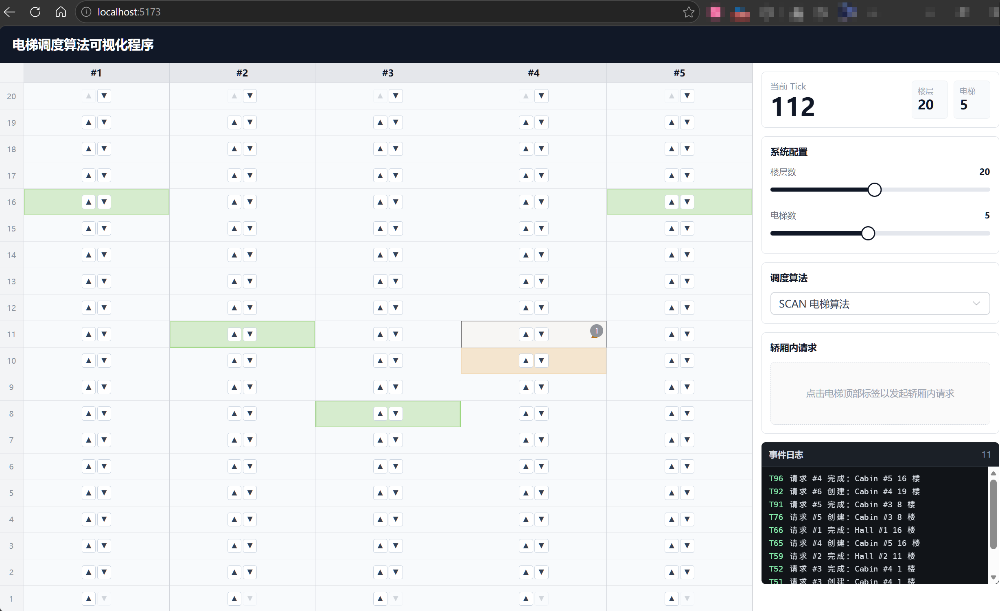

# 电梯调度算法可视化程序

## 项目简介

实现一个电梯调度系统，支持多种调度算法（FCFS、SCAN、LOOK、First Available、Nearest Idle），并提供 Web 前端可视化展示电梯运行状态。



## 技术栈

- 后端：Go（标准库 `net/http`）
- 数据库：SQLite
- 前端：Vue 3 + Element Plus + Vite

## 开发环境

WSL2 Ubuntu 24.04.4 LTS

推荐使用 Docker 启动。也可以在本机直接安装 Go 和 Node.js 后手动启动。

## 快速开始：Docker 版本（推荐）

这个方式会用 Docker Compose 同时启动后端和前端，适合快速运行项目。

### 环境要求

- 可以正常执行 `docker` 和 `docker compose`

### 启动

在项目根目录执行：

```bash
docker compose up
```

如果希望后台运行：

```bash
docker compose up -d
```

启动成功后访问：

```text
http://localhost:5173
```

后端 API 会运行在：

```text
http://localhost:8080
```

可以用下面的命令检查后端是否正常：

```bash
curl http://localhost:8080/api/health
```

正常返回：

```json
{"status":"ok"}
```

### 停止

如果是前台运行，按 `Ctrl+C` 停止。

如果是后台运行，执行：

```bash
docker compose down
```

第一次启动会拉取 Go 和 Node.js 镜像，并安装前端依赖，耗时会比较久；之后再次启动会复用缓存。

## 快速开始：普通本机版本

这个方式适合开发时分别启动后端和前端。

### 环境要求

- Go
- Node.js 和 npm

### 启动后端

在项目根目录执行：

```bash
go run ./cmd/server
```

后端默认监听：

```text
http://localhost:8080
```

### 启动前端

另开一个终端执行：

```bash
cd web
npm install
npm run dev
```

前端默认监听：

```text
http://localhost:5173
```

浏览器访问 `http://localhost:5173`。

## 项目结构

```text
cmd/server/             程序入口
internal/elevator/      电梯核心逻辑（模型、调度接口、多种调度算法、SQLite 请求持久化）
internal/api/           HTTP API handler（路由注册、自动步进）
web/                    前端页面（Vue 3 + Element Plus）
docs/                   学习记录
```
